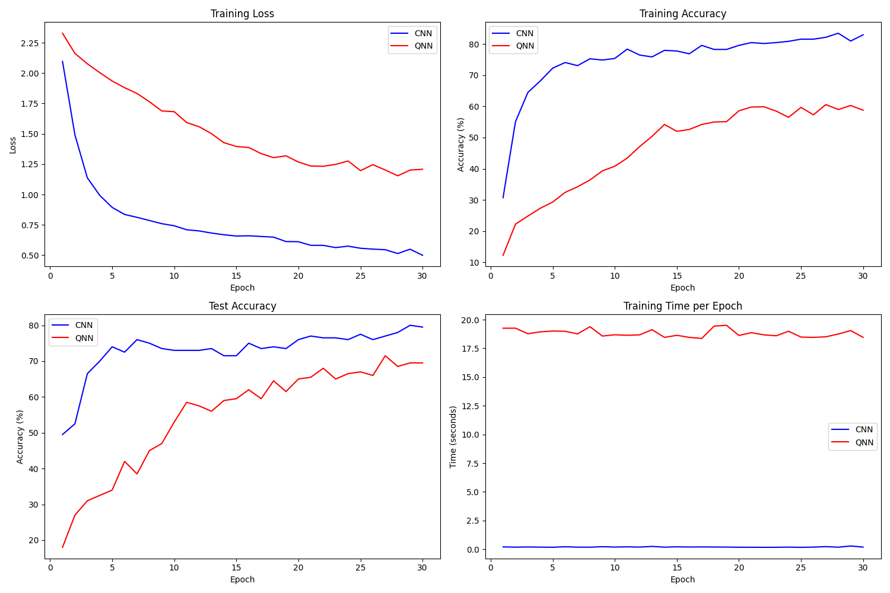
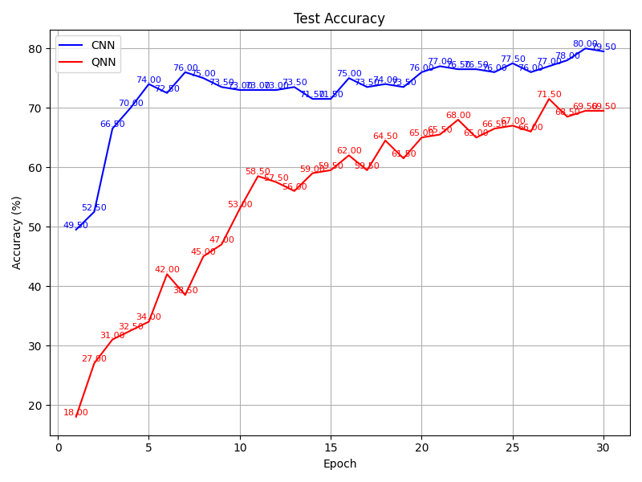
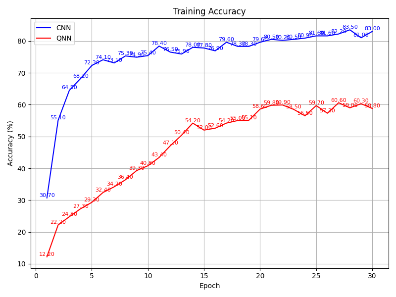
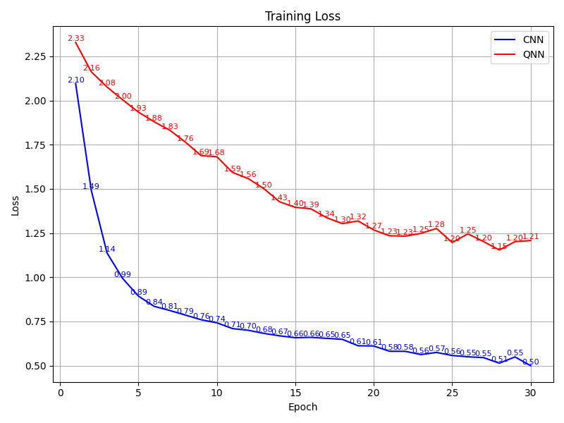
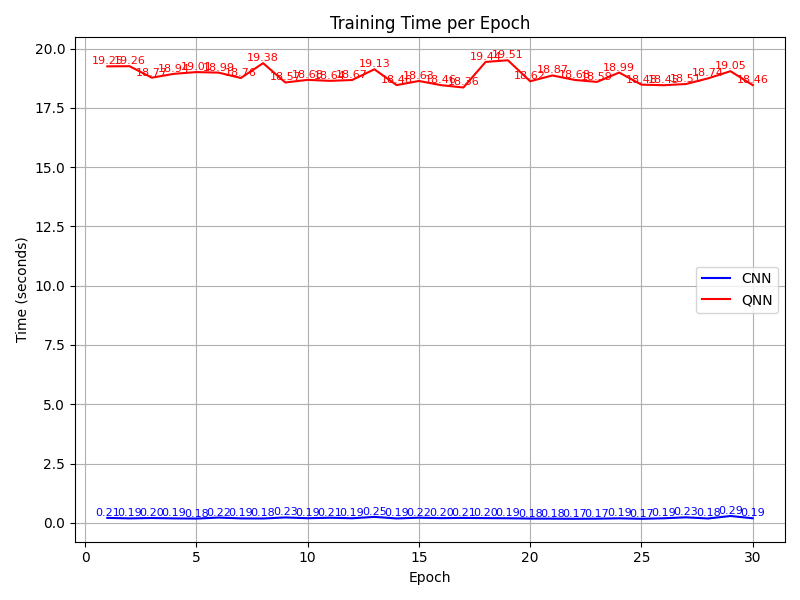

# CNN vs QNN Comparison Project

## Overview
This project compares the performance of Convolutional Neural Networks (CNNs) and Quantum Neural Networks (QNNs) on image classification tasks. The goal is to understand how both models perform in terms of accuracy, loss, and training time.

## Visual Results
The results of the comparison are presented through several graphs. Below are the images along with explanations:

### 1. Comparison of QNN and CNN Performance

This graph illustrates the overall performance of the QNN compared to the CNN. It highlights how each model performed in classifying images.

### 2. Test Accuracy Comparison

This graph compares the test accuracy of the CNN and QNN after training. It helps to visualize which model achieved a higher accuracy on unseen data.

### 3. Training Accuracy

This plot depicts the training accuracy over epochs for both models. It shows how the accuracy of each model improves as training progresses.

### 4. Training Loss

This graph illustrates the training loss for both models over epochs. A decreasing trend in loss indicates that the models are learning effectively.

### 5. Training Time Comparison

This graph compares the training times of the CNN and QNN. It indicates how long each model took to complete training, which is an important factor in model deployment.

## Conclusion
This project provides a visual and comparative analysis of CNNs and QNNs in image classification tasks. The graphs illustrate key performance metrics, allowing for easy comparison of the strengths and weaknesses of each model.

## References
- LeCun et al., "Gradient-Based Learning Applied to Document Recognition."
- O'Leary et al., "Quantum Neural Networks."
- Ghosh et al., "Quantum and classical neural networks: A comparison."
